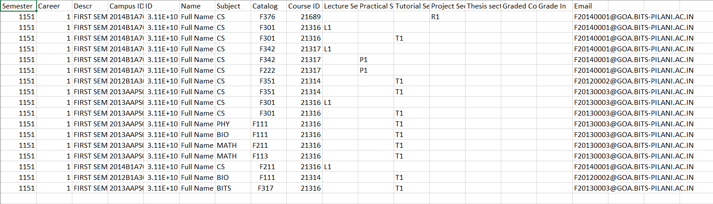
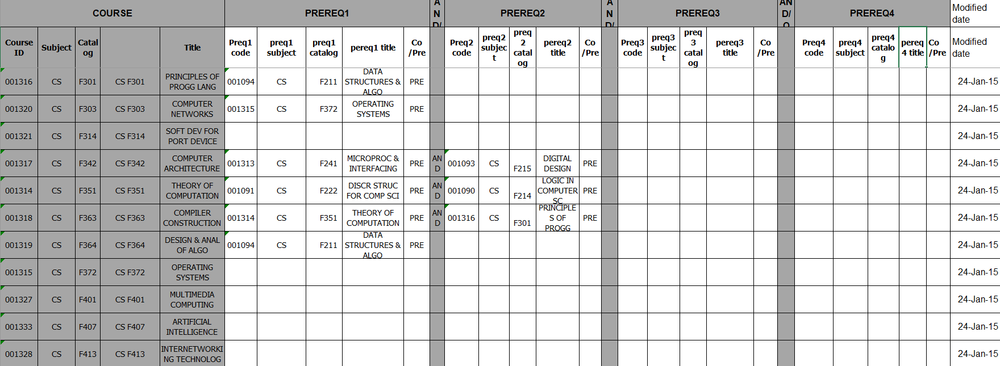
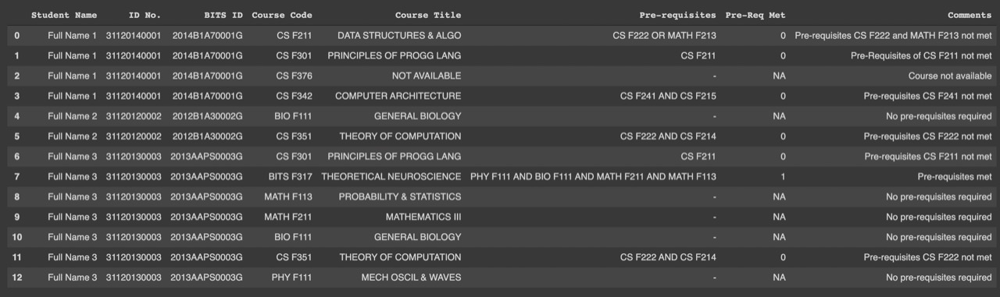

## Python script to check fulfillment of prerequisites of courses by a student
 This project is made for AUGSD Software Team Inductions, 2021.


   

* This script takes input from the user in the form of a CSV file consisting of the registration data of the students and an excel file containing list of courses available and their prerequisites, in the following format keeping case-sensitivity in mind along with stray white spaces.








* The output is in the format given below and contains the courses registered by the student(whose name and ID are mentioned), their prerequesites(if any) along with the list of unsatisifed prerequisites(if any) and comments regarding the registration status of the subject. 




* To view all 10 columns of the output make the following changes in the [script.py](https://github.com/ayushpaine/AUGSD-script/blob/main/augsd_prereq.py) file in the project folder(although, the "10" may be substituted with any digit from 1-10 to view the respective amount of columns).
```python
   pd.options.display.max_columns = 10
```

* To run the project :
   * On Windows -
     
     ```
     git clone https://github.com/ayushpaine/AUGSD-script.git
     cd AUGSD-script/
     pip install -r requirementsWIN.txt
     python augsd_prereq.py
     ```
   
   * On macOS and Linux -
     
     ```
     git clone https://github.com/ayushpaine/AUGSD-script.git
     cd AUGSD-script/
     pip3 install -r requirementsUNIX.txt
     python3 augsd_prereq.py
     ```

To add custom data, replace the given CSV and excel files with your own, in the aforementioned directory, and make sure that the files are in the same format as mentioned above.

Make sure you have that you have python installed by running the following on your respective terminals -

```
python --version
```

Any version >= 3.7 would suffice. If you don't have it installed, then you can [download](https://www.python.org/downloads/) it from here.


## Working of the project

* This script is made using the NumPy and Pandas python libraries which extract data from a CSV file containing student details and check it against an excel file containing registration data for the available subjects.

* The script takes in a ```regdata.csv``` file and a ```Pre-requisite_final.xlsx``` file and created Pandas DataFrames out of both of them and extracts the courses, name and other details for a particular student from the ```regdata.csv``` DataFrame and stores them in python dictionaries. Next, these dictionaries are iterated upon and their contents are ran through various conditions inside the ```Pre-requisite_final.xlsx``` DataFrame and depending upon these conditions, they are stored in various python lists. If certain prerequisites aren't registered then they are stored in a list. Finally, all these lists containing specific data are appended to an output DataFrame which is then printed and is visible on the terminal and a CSV file is also generated for the same. 

For detailed explanation of the script, refer to the [Jupyter Notebook file](https://github.com/ayushpaine/AUGSD-script/blob/main/AUGSD_prereq.ipynb).

# Contact
E-mail : [Shreyas V](mailto:shreyas.college@gmail.com), [Ayush Paine](mailto:ayushmt701@gmail.com)
